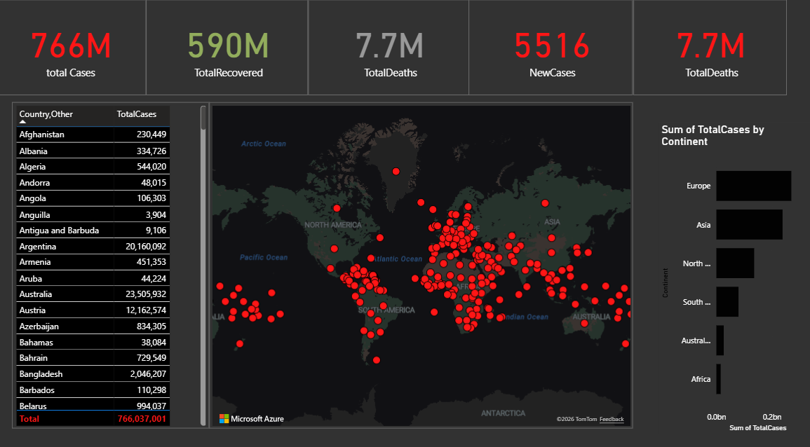

# COVID-19 Global Data Analysis Dashboard – Power BI

## Overview
This project presents an interactive dashboard built using Microsoft Power BI to analyze global COVID-19 statistics. The dashboard visualizes key metrics such as total confirmed cases, recoveries, and deaths, allowing users to explore pandemic trends across different countries and continents.

The report provides an intuitive interface that helps users quickly understand the global spread of COVID-19 through interactive charts, tables, and geographic visualizations.

---

## Dashboard Preview

---

## Project Objectives
The objective of this project is to transform raw COVID-19 data into meaningful insights through interactive data visualization.

Key goals include:

- Visualizing global COVID-19 statistics
- Comparing cases, recoveries, and deaths across countries
- Analyzing the distribution of cases by continent
- Providing interactive filtering for geographic analysis

---

## Key Metrics
The dashboard highlights several important indicators:

- **Total Cases**
- **Total Recovered**
- **Total Deaths**
- **New Cases**

These KPIs allow quick monitoring of the pandemic situation worldwide.

---

## Dashboard Features
The report includes multiple interactive visualizations:

- KPI cards displaying global statistics
- World map visualization showing case distribution
- Country-level data table
- Bar chart comparing total cases by continent
- Dynamic filtering by continent or country

When a user selects a specific continent or country, all dashboard metrics update automatically to reflect the selected data.

---

## Data Analysis
The dashboard uses Power BI data modeling and calculated measures to analyze pandemic data and generate meaningful visual insights.

Key analysis techniques include:

- Data aggregation by country
- Geographic visualization using map charts
- Comparative analysis by continent
- Interactive filtering for dynamic insights

---

## Tools & Technologies
- Microsoft Power BI
- Data Visualization
- Data Modeling
- Interactive Dashboards

---

## Files Included
This repository contains:

- `COVID_Dashboard.pbix` – Power BI report file  
- `Screenshot 2026-03-11 221532.png` – dashboard preview image

---

## Skills Demonstrated
This project demonstrates several data analytics skills:

- Data visualization
- Interactive dashboard development
- Geographic data analysis
- Business intelligence reporting

---

## Project Type
Data Visualization Project using Microsoft Power BI
